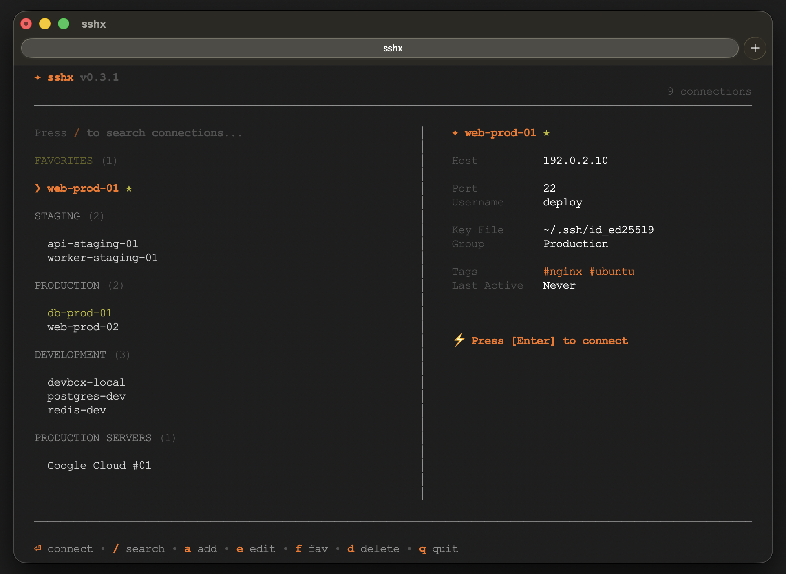
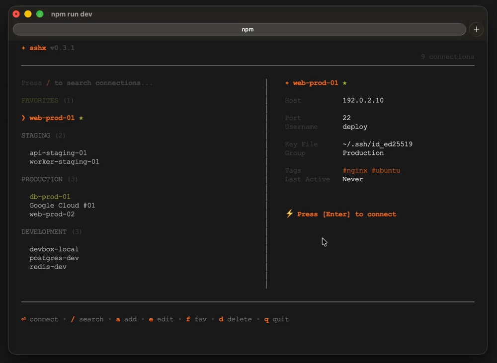

# Sshx

A modern terminal SSH manager for managing SSH vaults, hosts, and interactive sessions from a keyboard-driven TUI.

[](https://www.npmjs.com/package/@ahmdrv/sshx)
[](https://www.npmjs.com/package/@ahmdrv/sshx)
[](LICENSE)
[](package.json)
[](tsconfig.json)
[](https://github.com/ahmadrivaldi-arv/sshx)

See released changes in [CHANGELOG.md](CHANGELOG.md), the
[custom theme guide](THEMES.md), and planned work in [ROADMAP.md](ROADMAP.md).

## Screenshot



## Demo Video



[View source video](screenshots/sshx-demo.mp4)

## Features

- Interactive terminal UI for browsing and connecting to SSH hosts.
- Add, edit, delete, duplicate, rename, and favorite connections.
- Realtime search from the TUI with `/`.
- Recent connection tracking.
- Import hosts from `~/.ssh/config`.
- Import connections from Sshx JSON/YAML export files.
- Export connections to JSON or YAML.
- Interactive SSH sessions through `node-pty`.
- Per-connection OpenSSH options, including optional weak-crypto warning suppression.
- Responsive compact layout for small terminals (toggle manually with `c`).
- Built-in and externally installed themes, custom accent colors, and persistent compact/ASCII preferences.
- Secure password storage:
  - macOS: Keychain
  - Linux: Secret Service via `secret-tool`
  - Windows: DPAPI for the current user
- Log viewer for Sshx runtime logs.

## Install

```bash
npm install -g @ahmdrv/sshx
sshx
```

For a local production-style install from this repository:

```bash
bun install
bun run build
npm pack
npm install -g ./ahmdrv-sshx-0.5.0.tgz
sshx
```

During development:

```bash
bun install
bun run dev
```

## Usage

Open the TUI:

```bash
sshx
```

Show help:

```bash
sshx --help
```

Show version:

```bash
sshx --version
```

## TUI Shortcuts

```text
Enter  connect to selected host
/      search, or type /add to add from search mode
a      add connection
e      edit selected connection
Ctrl+S save immediately while adding/editing
d      delete selected connection with confirmation
f      toggle favorite
c      toggle compact layout for the current session
Esc    cancel current mode
q      quit
```

## Commands

```text
sshx add [options] <name>       Add a new SSH connection
sshx edit [options] <id>        Edit an SSH connection by id
sshx list [options]             List configured SSH connections
sshx delete <id>                Delete an SSH connection by id
sshx duplicate <id>             Duplicate an SSH connection by id
sshx rename <id> <name>         Rename an SSH connection by id
sshx favorite <id>              Toggle favorite status by id
sshx import [options]           Import connections from ~/.ssh/config or Sshx JSON/YAML export
sshx export [options] <file>    Export connections to JSON or YAML
sshx connect <target>           Connect by id or exact name
sshx ssh <target>               Alias for connect
sshx logs [options]             Show Sshx log file
sshx theme list                 List built-in and installed themes
sshx theme set <name>           Set theme and display preferences
sshx theme preview <name>       Preview a theme without applying it
sshx theme install <file>       Install an external JSON theme
sshx theme path                 Show the custom theme directory
```

## Examples

Add a password-based connection:

```bash
export SSHX_PASSWORD='server-password'
sshx add "Production" \
  --host 1.2.3.4 \
  --username root \
  --port 22 \
  --group Production \
  --tags Laravel,Ubuntu \
  --password-env SSHX_PASSWORD
unset SSHX_PASSWORD
```

Add a key-based connection:

```bash
sshx add "Web-01" \
  --host 1.2.3.4 \
  --username root \
  --identity-file ~/.ssh/id_ed25519 \
  --group Production
```

Add OpenSSH options and suppress the weak-crypto warning:

```bash
sshx add "Legacy Server" \
  --host 1.2.3.4 \
  --username root \
  --ssh-option ServerAliveInterval=30 \
  --ssh-option StrictHostKeyChecking=accept-new \
  --suppress-weak-crypto-warning
```

List connections:

```bash
sshx list
```

Search from the CLI:

```bash
sshx list --search prod
```

Connect:

```bash
sshx connect "Production"
```

Import from OpenSSH config:

```bash
sshx import
```

Import from Sshx export:

```bash
sshx import --file connections.json
sshx import --file connections.yaml
sshx import --file backup.txt --format json
```

Export:

```bash
sshx export connections.json --format json
sshx export connections.yaml --format yaml
```

View logs:

```bash
sshx logs
sshx logs -n 200
sshx logs --path
```

Manage themes:

```bash
sshx theme list
sshx theme preview dracula
sshx theme set dracula
sshx theme set nord --accent '#5e81ac' --compact
sshx theme set mono --ascii
sshx theme set default --clear-accent --expanded --unicode
sshx theme install ~/Downloads/ocean.json
sshx theme set ocean --clear-accent
```

Available themes are `default`, `minimal`, `mono`, `dracula`, `nord`, `catppuccin`,
and `tokyo-night`, plus JSON themes installed in the user theme directory. Theme
previews do not modify your configuration. See [THEMES.md](THEMES.md) for the
external theme format and sharing instructions.

## Configuration

Configuration is stored at:

```text
~/.config/sshx/config.json
```

Example:

```json
{
  "connections": [
    {
      "id": "uuid",
      "name": "Production",
      "host": "1.2.3.4",
      "port": 22,
      "username": "root",
      "identityFile": "~/.ssh/id_ed25519",
      "group": "Production",
      "tags": ["Laravel", "Ubuntu"],
      "color": "red",
      "favorite": true,
      "sshOptions": {
        "ServerAliveInterval": "30"
      },
      "suppressWeakCryptoWarning": false,
      "createdAt": "2026-07-02T00:00:00.000Z",
      "updatedAt": "2026-07-02T00:00:00.000Z"
    }
  ],
  "recentConnectionIds": [],
  "theme": {
    "name": "dracula",
    "accentColor": "#bd93f9",
    "compact": false,
    "ascii": false
  }
}
```

Passwords are not stored in `config.json`. Sshx stores only a secret reference and keeps the password in the OS credential store.

`accentColor` is optional and must use `#RRGGBB` format. Compact mode is also
enabled automatically when the terminal is too small for the expanded layout.

## Requirements

- Node.js 20 or newer.
- OpenSSH client available on `PATH`.
- Bun is only required for development and release builds.

On Linux, install `secret-tool` first. For example, Debian/Ubuntu:

```bash
sudo apt install libsecret-tools
```

## Development

```bash
bun install
bun run dev
bun run check
```

## Release

```bash
bun run check
npm pack --dry-run
npm publish --access public
```

Create and push the matching Git tag after publishing:

```bash
git tag v0.5.0
git push origin development v0.5.0
```

The published package includes only `dist`, `scripts`, `README.md`, `CHANGELOG.md`,
`THEMES.md`, and `LICENSE`.
